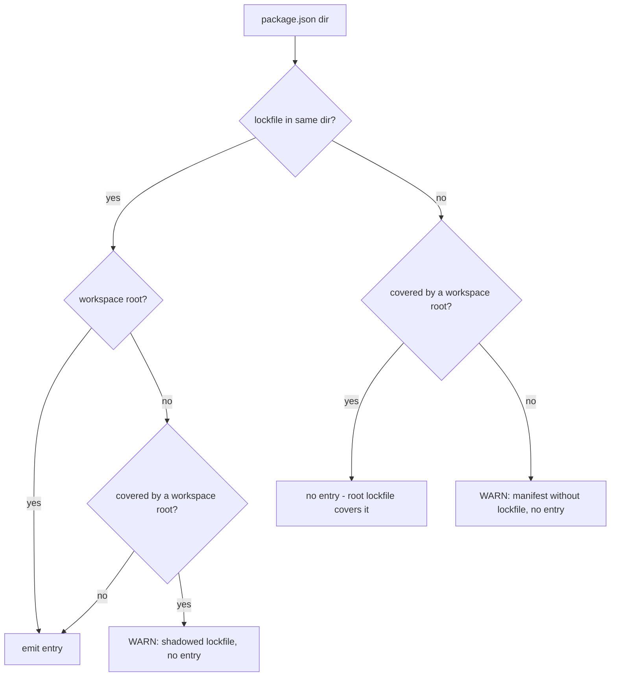

# Spec: `dependabot.yml` directory-mapping detection (QAO-641)

Status: **approved** — reviewed by mahangu (2026-07-21) and jamel.reid (2026-08-11).
Tracking: [QAO-641](https://linear.app/a8c/issue/QAO-641) · builds on the bootstrap script ([QAO-640](https://linear.app/a8c/issue/QAO-640))

## 1. Problem

When a manifest/lockfile is not at Dependabot's default path (npm/yarn/pnpm workspaces, monorepos, non-root lockfiles), `dependabot.yml` needs an explicit `directory` mapping. Without it the repo passes preflight, but its security PRs ship without lockfile updates, CI stays red, and auto-merge never fires — the one failure mode preflight cannot catch.

Goals: detect lockfile locations **remotely** (no full clone), generate or update `.github/dependabot.yml` with explicit mappings, idempotently, with `--dry-run` support consistent with the rest of the bootstrap.

## 2. Ecosystem coverage (v1)

| Ecosystem (`package-ecosystem`) | Manifests | Lockfiles | Workspace mechanism |
|---|---|---|---|
| `npm` (covers npm/yarn/pnpm) | `package.json` | `package-lock.json`, `npm-shrinkwrap.json`, `yarn.lock`, `pnpm-lock.yaml` | `workspaces` field in `package.json`; `packages:` list in `pnpm-workspace.yaml` |
| `composer` | `composer.json` | `composer.lock` | none |
| `github-actions` | `.github/workflows/*.yml`/`*.yaml` | n/a | n/a — always `directory: "/"` |

**Deferred to v1.1+:** `gomod`, `bundler`, `pip`, `cargo`, `docker`, `gitsubmodule`. The fleet (~2,352 repos) is overwhelmingly composer- and npm-family, and each extra ecosystem multiplies heuristic risk (pip alone has `requirements.txt`/`Pipfile`/`pyproject`/`uv.lock` variants). The script emits a `WARN` when it sees a recognizable deferred-ecosystem lockfile (`Gemfile.lock`, `go.sum`, `Cargo.lock`, `poetry.lock`, `uv.lock`) so partial coverage is never silent.

## 3. Remote detection (no clone)

- Default branch: `gh api repos/{owner}/{repo} --jq .default_branch`.
- File list: `gh api repos/{owner}/{repo}/git/trees/{branch}?recursive=1`, filtered to `type == "blob"` with jq.
- **Truncated tree** (`"truncated": true`; hit past ~100k entries / 7 MB): fall back to a blobless shallow clone (`git clone --depth 1 --filter=blob:none` + `git ls-tree -r HEAD --name-only`) in a temp dir. Never proceed on a truncated list — a silently incomplete file list is exactly the failure mode this feature exists to prevent. If the server refuses the filter (GHES without `uploadpack.allowFilter`), stop with a `PROBLEM` rather than full-cloning a repo large enough to truncate the tree API; `--allow-full-clone` is the explicit opt-in.
- File **contents** are fetched only for workspace declarations: candidate workspace-root `package.json` files (a `package.json` with a sibling lockfile) and every `pnpm-workspace.yaml`, via the Contents API. Bounded: a handful of fetches per repo, never one per package.

## 4. Decision rules

### Exclusions

A path is skipped if any directory segment matches:

- **Hard-exclude (silent):** `node_modules`, `vendor`, `bower_components`, `.git`
- **Soft-exclude (skipped with `WARN`, overridable via `--include <dir>`):** `fixtures`, `__fixtures__`, `testdata`, `examples`, `example`, `dist`, `build`, `.next`, `coverage`

### npm-family algorithm

1. Let **M** = dirs of all non-excluded `package.json` files; **L** = dirs of all non-excluded lockfiles.
2. A dir in L ∩ M whose `package.json` has a `workspaces` field, or that contains `pnpm-workspace.yaml`, is a **workspace root**.
3. Expand each root's workspace globs against M, relative to the root (`*` does not cross `/`, `**` does, `!` patterns exclude) → the **covered set**.
4. Emit one `(npm, dir)` entry for every dir in L that is a workspace root or is not covered by any workspace root. Repo root → `directory: "/"`.
5. A covered `package.json` **without** its own lockfile → **no entry** (the root lockfile covers it). This is the rule that prevents per-package entry spam in hoisted monorepos.
6. A covered `package.json` **with** its own lockfile → no entry + `WARN "shadowed lockfile at <path> inside workspace <root>"` — hoisted installs ignore it, and PRs against it would churn a file CI never reads.
7. An uncovered `package.json` with **no** lockfile at all → no entry + `WARN`.

`workspaces` is read in both shapes: the array form, and yarn v1's object form (`{"packages": [...], "nohoist": [...]}`). A `workspaces` field in any *other* shape produces a `WARN` rather than being treated as absent — silently deciding a monorepo has no workspaces is what produces per-package entry spam.



### composer

Every non-excluded dir containing **both** `composer.json` and `composer.lock` gets an entry. `composer.json` without a lock → `WARN`, no entry (frequently a library whose consumers resolve deps, or a committed-vendor WP plugin). Composer has no workspace concept; path repositories don't change anything because the rule keys on the lock.

### github-actions

Any file matching `.github/workflows/*.ya?ml` → ensure `(github-actions, "/")`. Known v1 limitation: composite actions outside the repo root are not detected.

## 5. Generated entry shape

One update block per `(ecosystem, directory)` pair in this repo's house style. **Hybrid directory form** (per mahangu's review — singular-only drifts when the script runs once at bootstrap and a package folder is added later):

- Two or more sibling dirs of the same ecosystem under one parent → one block with a glob: `directories: ["/projects/plugins/*"]`. New siblings added after bootstrap are covered without a re-run.
- Otherwise → singular `directory:`.

npm workspace roots always get a singular entry — the root lockfile already covers packages added later, so there is nothing for a glob to absorb.

Two guards bound the glob. Either one trips → fall back to singular entries plus a `note` saying why.

- **Guard 1: never glob the repo root.** A parent of `/` would emit `directories: ["/*"]`, sweeping every top-level directory in the repo. Two top-level composer packages stay singular.
- **Guard 2: the glob must not re-include what we excluded.** Emit `/parent/*` only when every directory under `parent` holding a manifest for that ecosystem is in the group — measured against the manifest set *before* exclusions. Otherwise `/projects/plugins/*` silently re-admits `projects/plugins/examples` (soft-excluded) and the lockless sibling we deliberately warned about, inverting the exclusion list's intent.

```yaml
- package-ecosystem: "composer"
  directories:
    - "/projects/plugins/*"
  schedule:
    interval: "weekly"
    day: "monday"
  open-pull-requests-limit: 0
  cooldown:
    default-days: 7
```

**`open-pull-requests-limit: 0` by default:** this disables scheduled *version*-update PRs (zero noise for repo owners) while the entry still gives Dependabot *security* updates the directory mapping they need — which is the entire point of QAO-641. A `--enable-version-updates` flag swaps in the full template (limit 10 + minor/patch grouping mirroring this repo's own [dependabot.yml](../.github/dependabot.yml)).

## 6. Idempotency and merge semantics

- **Read** existing `.github/dependabot.yml` via the Contents API (`Accept: application/vnd.github.raw`); YAML→JSON for inspection, then jq.
- **Coverage check** normalizes directories (strip trailing slash, ensure leading slash) and recognizes *all* existing forms: singular `directory`, `directories:` arrays, and globs inside `directories` (an existing `"/packages/*"` covers a detected `/packages/foo` — match the glob, don't duplicate). An entry carrying `target-branch` does **not** count as coverage: Dependabot's security updates ignore those entries, so counting one would silently reintroduce the bug this ticket exists to fix.
- **When coverage is ambiguous, treat it as covered and `WARN`.** Under-coverage leaves the status quo. A duplicate `(ecosystem, directory)` pair makes Dependabot reject the whole config file, disabling updates the repo already had — strictly worse. For the same reason, a failure to parse the existing config is a `PROBLEM` that stops the run; it must never fall through to "nothing is covered, append everything".
- **Merge rules:** never delete or modify existing update blocks; only append blocks for missing `(ecosystem, directory)` pairs. If the file doesn't exist, generate it whole (`version: 2` + entries). Re-run with full coverage → all `OK`, zero writes.
- **Write strategy:** append-only *text* operation on the original file bytes, matching the detected indentation of existing `- package-ecosystem:` items — never a YAML round-trip (round-tripping destroys comments and reorders keys). An `updates:` key with no items is still a safe append target: infer the indent from the file, else default to two spaces.
- **`PROBLEM` (stop, no writes):** inline-form `updates: []`/`{}`; tab indentation; multi-document files; anchors, aliases or merge keys; `.updates` not a sequence; a `.github/dependabot.yaml` where Dependabot expects `.yml`; any YAML parse failure.
- **Conflict `WARN`s (never auto-fixed):** an existing entry pointing at a directory with no detected manifest (stale); an existing npm entry for a workspace-covered child alongside a root entry.

## 7. How the change lands

Never push to the default branch. The script creates branch `bootstrap/dependabot-directories`, PUTs the file via the Contents API, and opens a PR whose body contains the detection report. Idempotency: an existing PR with identical proposed content → `OK (PR #N pending)`; differing content → update the branch. `--dry-run` prints a unified diff (current vs proposed `dependabot.yml`) plus the would-be summary lines, and performs zero writes.

The branch ref is never force-updated — reviewer commits on it would be destroyed. Instead, a branch that already exists is compared against the base; if it touches anything but `.github/dependabot.yml`, the run stops with a `PROBLEM`.

Every write is a non-GET `gh api` call routed through `bootstrap.sh`'s `mutate` funnel, including the PR itself (the pulls REST API, not `gh pr create`). That keeps "`--dry-run` issues no non-GET call" provable by counting stub invocations, exactly as [tests/bootstrap.bats](../tests/bootstrap.bats) does today.

## 8. Command sketch

```
go run ./cmd/dependabot-directories <owner/repo> [--dry-run] [--detect-only] [--include <dir>]... [--enable-version-updates] [--paths-from-file <f>]
```

Standalone Go command — one `package main` under `cmd/dependabot-directories`, its files following the pipeline order (report, detection, globs, config, sources), run with `go run` from the checkout so nothing compiled is ever committed — later invoked as one idempotent step of `scripts/bootstrap.sh` (QAO-640); adopts its conventions (`mutate` funnel for every write, `CHANGED`/`OK`/`WARN`/`PROBLEM` line items, exit 0 clean / 1 problems / 2 usage). Pipeline: resolve branch → fetch tree (truncation fallback) → filter/exclude → per-ecosystem detection → desired pairs → read existing config → coverage diff → render blocks → dry-run diff or branch + PR → summary.

Testability rests on one seam: detection reads the repository through a small source interface (path list plus blob reads). `--paths-from-file` swaps in a fixture-backed implementation, so the whole heuristic runs offline against synthetic repositories with no API calls. `--detect-only` prints the report and stops before the config stages.

YAML (`pnpm-workspace.yaml`, the existing config) is parsed with `gopkg.in/yaml.v3`; the dependencies are yaml.v3 and urfave/cli, nothing else. The structural shape checks stay text-level on purpose — the append-only splice edits bytes, so its guards must reason about bytes, never a parse.

## 9. Verification

### Offline fixtures

Synthetic path lists under `cmd/dependabot-directories/testdata/trees/`, driven through `go test` via the same `--paths-from-file --detect-only` flags an operator would use, with no API calls: baseline root npm; yarn workspaces (array and v1 object form); shadowed lockfile; negated workspace globs; `**` including the zero-segment case; pnpm with and without a `packages:` key; composer siblings (glob emitted); composer siblings with a lockless fourth (Guard 2 trips); two top-level siblings (Guard 1); exclusions and `--include`; deferred-ecosystem lockfiles; paths with spaces, `+`, `[` and unicode; a jetpack-shaped mixed monorepo.

### Sandbox repos

Six purpose-built repos, per jamel.reid's review. Offline fixtures prove the logic; these prove GitHub's APIs and Dependabot's own behaviour.

| Repo | Layout | Exercises |
|---|---|---|
| `qao641-fixture-npm-root` | root npm + workflows | baseline, PR path end to end |
| `qao641-fixture-yarn-ws` | yarn workspaces, one shadowed lock | no per-package spam, WARN fires |
| `qao641-fixture-pnpm-composer` | pnpm root + `projects/plugins/{a,b,c}` | **Dependabot actually resolving `/projects/plugins/*`** — the one thing offline fixtures cannot prove |
| `qao641-fixture-glob-guard` | as above + a lockless fourth sibling | Guard 2 against a real tree |
| `qao641-fixture-existing-config` | hand-written commented config, partial coverage, 4-space indent | append-only merge preserves comments in a real PR diff |
| `qao641-fixture-rerun` | run twice | second run all `OK`, zero mutations |

### Dry-run matrix

All read-only, against real repos; expected vs actual pasted into the script PR.

| Shape | Repo | Exercises |
|---|---|---|
| Yarn workspaces, huge tree | Automattic/wp-calypso | workspace coverage rules + tree-truncation fallback |
| pnpm + composer monorepo | Automattic/jetpack | `pnpm-workspace.yaml` parsing, mixed ecosystems, nested `composer.lock`s |
| pnpm monorepo + composer | WooCommerce/woocommerce | second data point for glob expansion |
| Actions-only | this repo | `(github-actions, "/")` idempotent no-op |

### Field notes from the first matrix run

Three things the real repos taught us that the draft did not anticipate:

- **jetpack and wp-calypso came out as designed.** jetpack yields `composer: /projects/plugins/*` (the glob rule doing exactly what §5 predicts) plus `composer: /`, `npm: /` and `github-actions: /`. wp-calypso yields `npm: /`, `composer: /` and `github-actions: /`. Neither tree truncated, so the clone fallback stayed unexercised.
- **Per-directory findings have to be aggregated.** A jetpack run produced 270 individual "manifest without lockfile" lines. A wall of text that long reports nothing, so findings of that kind now print as a count plus the first five paths and an "… and N more" tail. Reported, never silent, and still readable.
- **"Cannot parse" and "declares nothing" are different facts.** WooCommerce's `pnpm-workspace.yaml` declares `packages:` on line 72, and every YAML parser rejects the file over a tab character on line 4. Reporting that as "declares no `packages:`" sends the reader hunting for a key that is right there.

WooCommerce also exposes the limits of the exclusion list as approved. It maps `/packages/php/email-editor/vendor-prefixed` and `/plugins/woocommerce/bin/composer/*` — vendored and tooling directories that hold a real `composer.json` and `composer.lock` but should never receive PRs. `--include` only re-admits soft-excluded names; there is no way to exclude a path the list does not already name. Worth settling before the write path lands: either extend the soft-exclude list (`vendor-prefixed` is the obvious first entry) or add an `--exclude <dir>` counterpart.

## 10. Resolved questions

| # | Question | Resolution |
|---|---|---|
| 1 | `yq` as a new dependency? | ~~Yes — as the expected backend, behind a probe-based shim with a zero-install Ruby fallback~~ Superseded (2026-08): the tool was rewritten in Go for reviewability; YAML is read with `gopkg.in/yaml.v3` and no external YAML tool is probed or required (§8) |
| 2 | Singular `directory` vs `directories:` + globs? | **Hybrid** (mahangu): glob when ≥2 same-ecosystem siblings share a parent, singular otherwise (§5) |
| 3 | Manifests without lockfiles | `WARN`-only, no entry |
| 4 | Workspace-covered package with its own lockfile | `WARN`-only — hoisted installs ignore it |
| 5 | `open-pull-requests-limit: 0` security-only default? | Yes; version updates opt in via `--enable-version-updates` |
| 6 | Tree truncation: fallback or stop? | **Fallback** (mahangu): `--filter=blob:none` confirmed working on our GHES version |
| 7 | PR vs direct commit to the default branch? | PR |
| 8 | Add `gomod` to v1? | Defer to v1.1; `WARN` on recognizable deferred lockfiles |
| 9 | Soft-exclude list and `--include` override | As drafted |
| 10 | Generated-entry cosmetics | House style — weekly Monday, `cooldown: default-days: 7` |

jamel.reid signed off on §2, §4 and every default above, and asked for the sandbox repos now listed in §9.

## 11. Implementation constraints

The tool is Go (originally bash; rewritten for reviewability after review on the detection PR). The constraints worth writing down:

- **Toolchain floor lives in `go.mod`** (go 1.26); operators need `go` and `gh`, nothing else. Dependencies are `gopkg.in/yaml.v3` and `urfave/cli` — no jq, no yq/ruby/PyYAML probing.
- **The GitHub API is reached by exec'ing the authenticated `gh` CLI** (argv slices, never a shell), and diffs by exec'ing `diff -u` — the same auth and rendering story the bash script had. The exec seam is also what keeps "`--dry-run` issues no writes" provable for the follow-up write path: a recording fake counts every call.
- **Sets are maps and slices, sorted byte-wise.** Go string ordering equals the `LC_ALL=C` collation the script forced on `sort` and `comm`, so report ordering is machine-independent by construction. Workspace globs are still translated to anchored regular expressions — there is no working tree to glob against, only a path list.
- **Behaviour is pinned by transcripts.** Golden transcripts captured from the bash script before its deletion live beside the fixtures; the Go binary reproduces them byte for byte, so the port (and any future reimplementation) is testable against exactly what ran before.

Entry counts are capped: a repo yielding more than ~50 pairs is a heuristic failure, not a real configuration, and stops with a `PROBLEM` unless overridden.

## 12. Out of scope: deploy-coupled repos

Whether a repo whose trunk commits ride a deploy train (e.g. wp-calypso) should get auto-merge at all is rollout policy, not detection — tracked in [QAO-697](https://linear.app/a8c/issue/QAO-697) (eligibility tiers, label-only mode).
